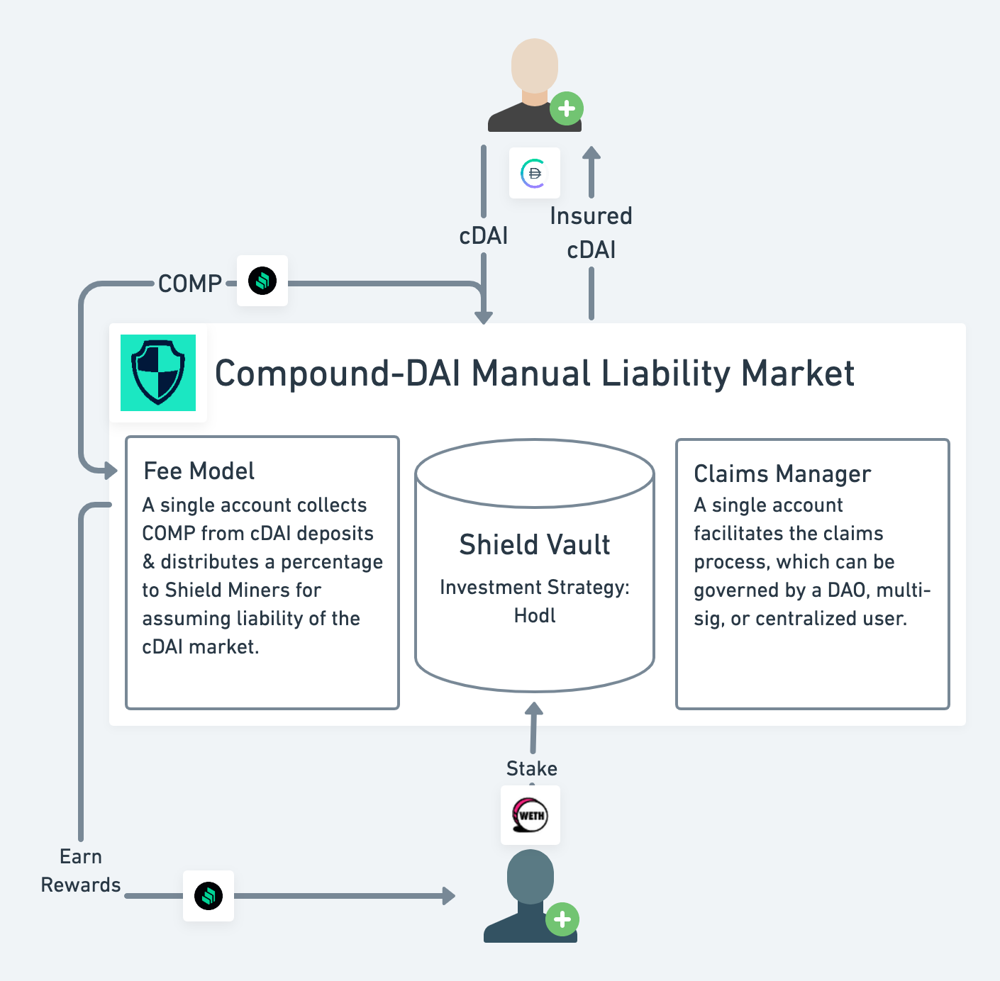

# Compound DAI Manual Liability Market
This Protekt Contract covers the DAI deposited into Compound. Premiums are paid each block via the COMP rewards of the deposited cDAI, and 20-30% is paid to the Shield Miners to cover the liability of the underlying Compound system.



## Contract Details
### Fee Model
Users become insured by depositing cDAI and getting 1:1 pcDAI back, and the coverage fees are claimed in the form of COMP on the underlying cDAI. If the staked amount is greated than the covered amount, all DAI is covered 100% and 30% of the COMP rewards go to the stakers. If the staked amount is less than the covered amount, only partial DAI is covered and 20% of the COMP rewards go to the stakers. 

Every Wednesday, a COMP rewards are collected on all cDAI deposits and are split between the insured and stakers block-by-block. The rewards are then claimable through the claims contracts for each week. Note that stakers can only withdraw their reserve tokens on Wednesdays as well, preventing front-running of any claims submissions.

### Investment Strategy
The reserve token (WETH) is held and not reinvested, resulting in a 0% APY.
* **StrategyHodl** - Held and not invested.

### Claims Manager
Anyone can submit a claim and if a payout event has occurred, then the pool enters the investigation period (1 week) where coverage and staking withdrawals are frozen. After the claim investigation period, if the payout event is still true, the Shield Mining contract is liquidated and WETH is claimable by pcDAI holders. The claims process is managed by a DAO controlling a multi-sig wallet.
* **InvestigationPeriod** - 43200 blocks (ie 1 week)
* **Governance** - DAO controlling a multi-sig wallet

#### Proof of Loss
For this contract, payout events will be specified by a DAO controlling a multi-sig wallet. In future phases, we seek to remove humans from the process and have payout events driven through smart contract queries:
* Payout Event for cDAI if: TotalBorrowed > TotalSupply + Reserves
```
CErc20 cDAI = CToken(0x3FDA...);
uint numTokens = cDAI.totalSupply();
uint totalSupply = numTokens.mul(cDAI.exchangeRateCurrent());
uint reserve = cToken.totalReserves();
uint borrows = cDAI.totalBorrowsCurrent();

bool activePayoutEvent = borrows > totalSupply.add(reserve) 
```

## All Data Fields
| Data Field | Category | Value |
|---------|----------|---------|
|Contract|Fee Model|Multi-sig wallet and manual fee calculation|
|CostDisplay|Fee Model|**20-30% COMP** rewards of your deposited DAI will be redirected to Shield Miners. The exact fee depends whether 100% coverage is offered or not.|
|CostCalculation|Fee Model|If the staked amount is greated than the covered amount, all DAI is covered 100% and 30% of the COMP rewards go to the stakers. If the staked amount is less than the covered amount, only partial DAI is covered and 20% of the COMP rewards go to the stakers.|
|StakerAPY|Fee Model|0.675 to 0.45 APY|
|WithdrawDisplay|Shield Token|Staking withdrawals can only be made on Wednesday of each week.|
|StrategyDisplay|Shield Token|Hodling (0% APY)|
|InvestigationPeriod|Claims Manager|1 week (ie 43200 blocks)|
|Governance|Claims Manager|DAO vote controlling a multi-sig wallet|
|CoverageDisplay|Claims Manager|Protection against 1) **smart contract bugs that allow hackers to steal or lock DAI** and 2) **risk that admin keys are stolen or used to withdraw DAI.** Not covered: 1) Risk of a Maker hack or DAI lossing its peg. 2) Risk of flash loan or other financial exploit.|
|ClaimManagerDisplay|Claims Manager|Claims are investigated for a period of **1 week**, and the payout decision is made by a DAO vote controlling a multi-sig wallet.|

